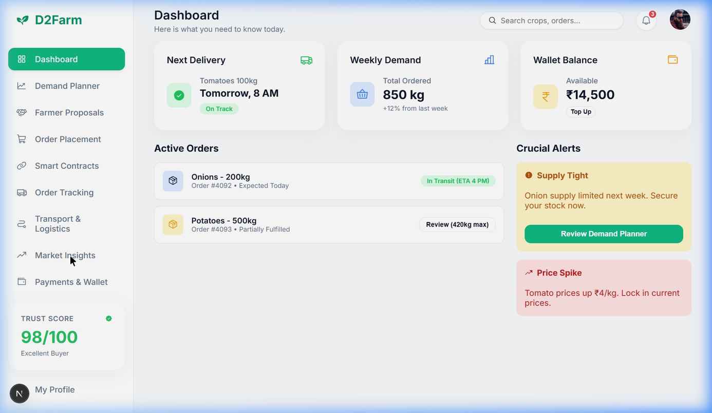
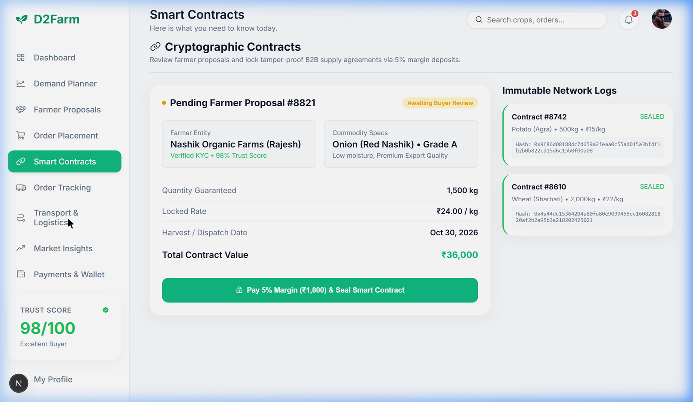
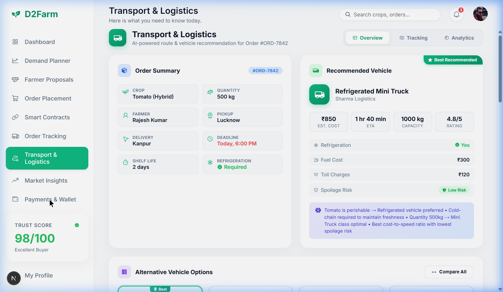
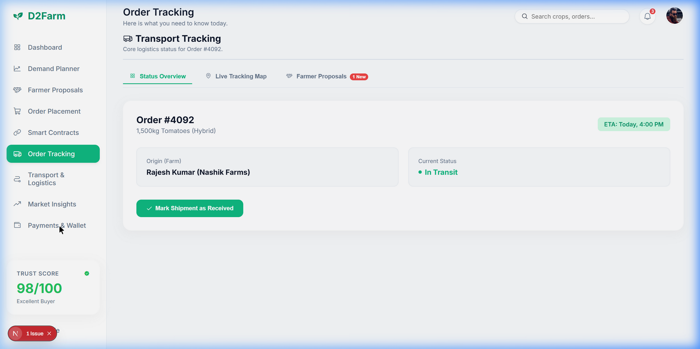
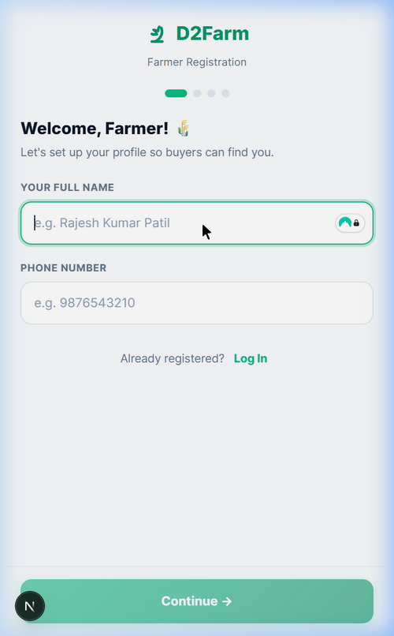
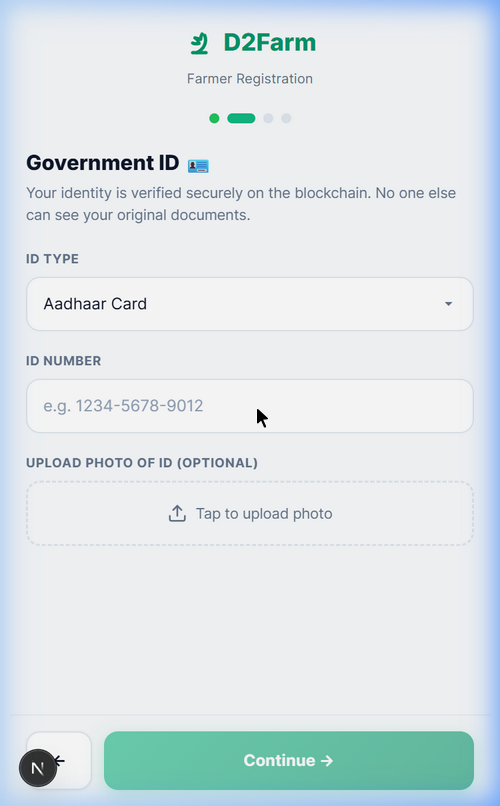
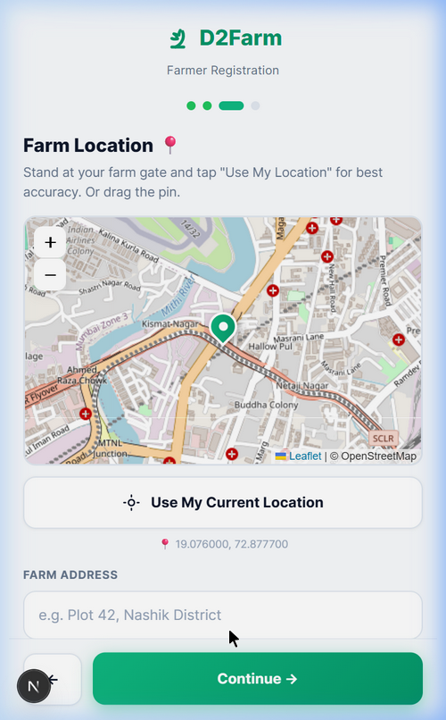
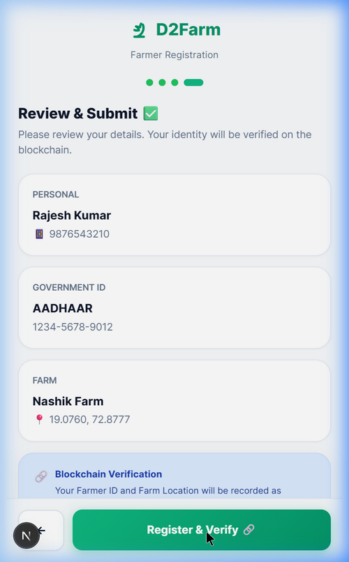

# 🌾 D2Farm — Demand-Driven Agri Exchange

<div align="center">

> Connecting future demand with upcoming supply **before harvest** — so farmers get fair prices and buyers get reliable supply.

**Target:** Madhya Pradesh, Uttar Pradesh, Bihar — where 80%+ farmers are small/marginal.

<br/>

## 🎬 Demo Video

[](https://www.youtube.com/watch?v=lvLU9a-PUEU&t=326s)

> ▶️ **Click the thumbnail above** to watch the full working demo on YouTube

<br/>

## 🚀 Live Deployments

| App | URL | Stack |
|:---:|:---:|:---:|
| 🌾 **Farmer App (PWA)** | [d2farm-1r1z.vercel.app](https://d2farm-1r1z.vercel.app/) | Next.js · Mobile-first · Installable |
| 🛒 **Buyer Dashboard** | [d2farm-6384.vercel.app](https://d2farm-6384.vercel.app/) | Next.js · Procurement · Analytics |
| ⚙️ **Backend API** | [d2farm.vercel.app](https://d2farm.vercel.app/) | Node.js · Express · MongoDB |

<br/>

## ⚡ Core Technology Stack


</div>

---


## 📸 Screenshots

### Buyer Dashboard (Web)

| Dashboard | Smart Contracts |
|:-:|:-:|
|  |  |
| Active orders, wallet balance, alerts | Blockchain-sealed contracts with farmers |

| Transport & Logistics | Order Tracking |
|:-:|:-:|
|  |  |
| AI-powered route & vehicle recommendations | Live shipment status with ETA tracking |

### Farmer App (Mobile)

| Onboarding | Government ID | Farm Location | Review & Verify |
|:-:|:-:|:-:|:-:|
|  |  |  |  |
| Name & phone setup | Aadhaar verification | GPS-based farm mapping | Blockchain identity mint |

---

## ❓ The Problem

Indian agriculture is **reactive** — farmers grow first, then search for buyers. This causes:

- **30–40% post-harvest losses** due to no pre-committed buyers
- **Price crashes** from oversupply at mandis (₹20/kg → ₹5/kg overnight)
- **Farmer distress** — no storage, no bargaining power, no market visibility

Meanwhile, buyers (restaurants, hotels) struggle with **price spikes** and **inconsistent supply**.

> This is not a production problem. It's a **coordination failure**.

---

## 💡 The Solution

D2Farm connects **future demand** (buyers placing orders 3–7 days ahead) with **upcoming supply** (farmers listing expected harvest) — **before** harvest happens.

```
Buyers place demand → AI matches → Farmers fulfill → Logistics deliver → Payment settled
     (3-7 days ahead)              (multi-farmer)       (cold-chain)       (escrow)
```

---

## ⚙️ How It Works

1. **Buyers** (restaurants, cloud kitchens) place forward demand with a 5–10% deposit
2. **Farmers** list their expected harvest (range-based, verified via past data)
3. **AI Engine** matches demand ↔ supply across multiple farmers with 20–30% buffer
4. **Logistics** handles pickup via hyperlocal aggregation hubs with route optimization
5. **Execution** — Harvest → Pickup → Delivery → Payment release

---

## 🏗️ Project Structure

```
d2farm/
├── frontend/          → Buyer Dashboard (Next.js 14 — Web)
│   └── src/
│       ├── app/       → Pages & layouts
│       └── components/
│           └── views/ → Dashboard, MarketInsights, SmartContracts,
│                        OrderPlacement, OrderTracking, TransportLogistics,
│                        Wallet, FarmerProposals, DemandPlanner, ProcurementAI
│
├── farmer/            → Farmer App (Next.js — Mobile-first)
│   └── src/
│       ├── app/       → Onboarding & main layout
│       └── components/
│           └── views/ → FarmerDashboard, CropListing, ProposalCenter,
│                        FarmerProfile, Onboarding, DeepTechEngine,
│                        TransactionTracker
│
├── backend/           → API Server (Node.js + Express + MongoDB)
│   ├── server.js      → Core REST API
│   ├── models/        → Order, User, Crop, CropListing, FarmerProfile,
│   │                    Proposal, Transaction
│   ├── routes/        → farmerRoutes, listingRoutes, matchRoutes,
│   │                    proposalRoutes
│   ├── contracts/     → D2FarmIdentity.sol (Solidity smart contract)
│   └── services/      → blockchainService.js
│
├── models/            → ML/AI Models (Python + scikit-learn)
│   ├── price_prediction.py    → Ensemble price forecasting (RF + GBR)
│   ├── crop_quality.py        → Multi-factor quality grading (A/B/C/Rejected)
│   ├── demand_forecasting.py  → Buyer demand prediction (seasonal + events)
│   ├── supply_confidence.py   → Farmer reliability scoring
│   ├── spoilage_risk.py       → Transit spoilage predictor
│   ├── route_optimizer.py     → Multi-stop transport optimizer
│   ├── matching_engine.py     → Demand ↔ Supply allocation engine
│   └── requirements.txt
│
└── screenshots/       → App screenshots for documentation
```

---

## 🔧 Tech Stack

| Layer | Technology | What It Does |
|---|---|---|
| **Buyer Frontend** | Next.js 14, React, TypeScript | Procurement dashboard, market insights, order management |
| **Farmer App** | Next.js, Tailwind CSS, Leaflet Maps | Mobile-first onboarding, crop listing, proposal management |
| **Backend API** | Node.js, Express.js | REST API for orders, proposals, matching, farmer profiles |
| **Database** | MongoDB (Mongoose) | Stores orders, users, crops, listings, proposals, transactions |
| **ML Models** | Python, scikit-learn, NumPy, Pandas | 7 production models — pricing, quality, demand, supply confidence, spoilage, routing, matching |
| **Blockchain** | Solidity, Polygon (ERC-721) | Soulbound Farmer ID NFTs, farmland verification, smart contracts |
| **Maps** | Leaflet + OpenStreetMap | GPS-based farm location capture and verification |

---

## 🧠 Technology Deep-Dive

### 🤖 AI / Machine Learning

- **Price Prediction Engine** — RandomForest model trained on supply/demand ratio, weather conditions, cultivation costs, and government policy. Predicts real-time ₹/kg pricing.
- **Market Insights Ledger** — Stock-market style dashboard showing historical, live, and AI-forecast prices with confidence scores and key price drivers.
- **Demand Planner** — Analyzes buyer procurement patterns to forecast upcoming needs.

### ⛓️ Blockchain (Polygon Network)

We use blockchain **selectively** — only where trust and immutability matter:

- **Soulbound Farmer ID (ERC-721)** — Non-transferable NFT that verifies farmer identity. Gov ID hash stored on-chain (privacy-preserving). Farmer never handles gas fees (Account Abstraction via ERC-4337).
- **Farmland Verification NFT** — GPS coordinates + farm size recorded on-chain as tamper-proof land records.
- **Smart Contracts for Escrow** — Buyer deposits (5–10%) locked in contract. Auto-released on delivery confirmation. Prevents payment disputes.
- **Immutable Transaction Logs** — Every proposal and contract is hashed and recorded on Polygon for audit trail.

> Blockchain is **NOT used** for fake demand/supply detection — that's handled by incentive design and reputation scoring.

### 🚛 Transport & Logistics

- AI-powered vehicle recommendations (refrigerated trucks for perishables, cost optimization)
- Route optimization with real-time tracking
- Spoilage risk assessment based on crop type, distance, and temperature

---

## 🛡️ Built for Indian Reality

We assume **everything will fail** — and design around it:

| What Can Go Wrong | How We Handle It |
|---|---|
| Farmer under-delivers | Multi-farmer allocation — no single point of failure |
| Buyer cancels | Deposit forfeiture via smart contract |
| Logistics breaks down | Backup transport + micro buffer hubs |
| Oversupply / Undersupply | Over-allocation at 120–130% + real-time rebalancing |
| System-wide failure | Mandi fallback integration |

> **System works even with 30% failure rate.**

---

## 🚀 Getting Started

### Prerequisites
- Node.js 18+
- MongoDB (local or Atlas)
- Python 3.9+ (for ML engine, optional)

### 1. Environment Setup
```bash
# Create .env in project root
MONGODB_URL=mongodb+srv://<user>:<password>@cluster/d2farm?retryWrites=true&w=majority
PORT=4000
```

### 2. Backend
```bash
cd backend
npm install
node seed.js     # Seed initial data
npm run dev      # Starts on port 4000
```

### 3. Buyer Dashboard
```bash
cd frontend
npm install
npm run dev      # Starts on port 3000
```

### 4. Farmer App
```bash
cd farmer
npm install
npm run dev      # Starts on port 3001
```

### 5. ML Engine (Optional)
```bash
cd ml_engine
pip install -r requirements.txt
python app.py    # Starts on port 5000
```

---

## 💰 Impact

| | Farmers | Buyers | Ecosystem |
|---|---|---|---|
| ✅ | 10–25% better prices | Stable supply | Reduced waste |
| ✅ | Guaranteed buyers before harvest | Predictable pricing | Efficient logistics |
| ✅ | No more distress selling | Lower procurement effort | Data-driven agriculture |

---

## 🗺️ Roadmap

- [x] Buyer procurement dashboard
- [x] AI pricing engine (ML model)
- [x] Real-time market insights ledger
- [x] Order management with deposit system
- [x] Blockchain smart contracts (Solidity + Polygon)
- [x] Farmer onboarding with blockchain identity
- [x] GPS-based farm verification
- [x] Transport & logistics with AI recommendations
- [x] Farmer proposal management
- [ ] Multi-farmer matching & allocation engine
- [ ] IoT integration for cold storage monitoring
- [ ] Mandi fallback integration
- [ ] Mobile apps (React Native)

---

## 👥 Team

Built for the **hardest agricultural markets** in India — MP, UP, Bihar — where the problem is deepest and the impact is highest.

---

<p align="center">
  <b>🌾 D2Farm</b> — Not just improving agriculture… <b>rewiring how it works.</b>
</p>
